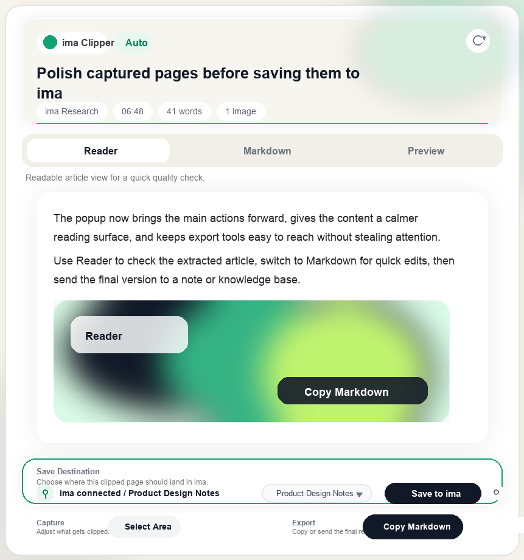

# Web Clipper for ima

A Chrome MV3 web clipper for turning web pages into clean Markdown and saving them to Tencent ima as notes or knowledge-base entries.



## What It Does

- Extracts readable article content from the current tab.
- Converts captured content to Markdown.
- Lets you review the result in `Reader`, `Markdown`, and `Preview` modes.
- Supports automatic capture, selected text capture, and manual area capture.
- Copies Markdown, copies source URL/title, downloads `.md` files, and opens ima.
- Connects to the ima OpenAPI with a Client ID and API Key.
- Saves captures as ima notes, optionally adding them to a selected knowledge base.

## Capture Modes

The badge next to `ima Clipper` shows where the current capture came from:

- `Auto`: normal automatic page extraction.
- `Selection`: capture from text selected before opening the popup.
- `Manual Area`: capture from an area chosen with `Select Area`.
- `Fallback`: fallback extraction when the page is hard to parse.

## ima Save Flow

1. Open the popup.
2. Click the gear icon in the ima row.
3. Paste your ima Client ID and API Key from `https://ima.qq.com/agent-interface`.
4. Pick `Note only` or a writable knowledge base.
5. Click `Save to ima`.

The extension first imports the Markdown as an ima note. If a knowledge base is selected, it then adds that note to the knowledge base.

## Install locally

```bash
npm install
npm run build
```

Then load the extension in Chrome:

1. Open `chrome://extensions/`.
2. Enable `Developer mode`.
3. Click `Load unpacked`.
4. Select the local `dist` folder from this repository.

## Development

```bash
npm run dev
npm test
npm run build
```

## Quality checks

```bash
npm test
npm run validate
npm run package
```

- `npm test` runs the app tests plus release-automation contract tests.
- `npm run validate` checks release prerequisites, version alignment, reviewed permissions, and required docs.
- `npm run package` validates, builds, and creates `dist/web-clipper-for-ima-<version>.zip`.

## Packaging

The packaged extension zip is written to `dist/web-clipper-for-ima-<version>.zip`.

## Project structure

```text
src/content/       Content script and manual area selection
src/background/    MV3 service worker and context menu handling
src/core/          Extraction, cleanup, and Markdown template logic
src/ui/popup/      Popup UI, export actions, and ima API / save integration
public/icons/      Extension icons packaged into dist
docs/              Manual test, store listing, privacy, and asset notes
scripts/           Packaging, validation, CWS publishing, and OAuth helpers
```

## Verification

For browser smoke testing, follow [docs/manual-test-checklist.md](docs/manual-test-checklist.md).
For release smoke testing, use [docs/release-smoke-checklist.md](docs/release-smoke-checklist.md).

## Chrome Web Store prep

Before submitting to the Chrome Web Store, review:

- [docs/privacy-policy.md](docs/privacy-policy.md)
- [docs/chrome-store-listing.md](docs/chrome-store-listing.md)
- [CHROME_STORE_SUBMISSION.md](/Users/halunhaku/projects/ima-extension/CHROME_STORE_SUBMISSION.md)

The extension package includes local icons under `public/icons`. Store listing screenshots and the 440x280 promotional image are uploaded separately in the Chrome Web Store Developer Dashboard.

## Release rules

- The release boundary is a pushed tag matching `vX.Y.Z`.
- Before creating the tag, `package.json` and `manifest.json` must already contain the same version.
- The GitHub Actions workflow rebuilds the extension, creates or reuses a draft GitHub Release, uploads the ZIP artifact, and submits the Chrome Web Store item for review.
- The GitHub Release is published only after the Chrome Web Store API accepts the submission.
- Push the release commit and the release tag explicitly. Do not rely on `--follow-tags` for lightweight tags.

Example release flow:

```bash
npm test
npm run validate
npm run package
git add package.json manifest.json README.md PRIVACY_POLICY.md CHROME_STORE_SUBMISSION.md .github/workflows/release.yml scripts docs
git commit -m "chore: release vX.Y.Z"
git tag vX.Y.Z
git push origin HEAD
git push origin vX.Y.Z
```

## Chrome Web Store automation setup

The release workflow expects these repository secrets:

- `CWS_CLIENT_ID`
- `CWS_CLIENT_SECRET`
- `CWS_REFRESH_TOKEN`
- `CWS_ITEM_ID`

Helpers:

- `npm run cws:auth` starts the OAuth consent flow and stores `CWS_REFRESH_TOKEN` through GitHub CLI.
- `npm run cws:publish -- dist/web-clipper-for-ima-<version>.zip` submits an already-built ZIP locally.

If the store submission succeeded but GitHub Release publication failed, rerun the workflow manually with:

- `tag = vX.Y.Z`
- `publish_github_release_only = true`

Use that recovery mode only after you confirm in the Chrome Web Store dashboard that the submission was accepted.

## Permissions

The current reviewed permission set is:

- `activeTab`
- `contextMenus`
- `scripting`
- `storage`
- `host_permissions: <all_urls>`

The detailed reviewer-facing justification lives in [CHROME_STORE_SUBMISSION.md](/Users/halunhaku/projects/ima-extension/CHROME_STORE_SUBMISSION.md).

## Privacy

The current privacy policy lives in [PRIVACY_POLICY.md](/Users/halunhaku/projects/ima-extension/PRIVACY_POLICY.md).
